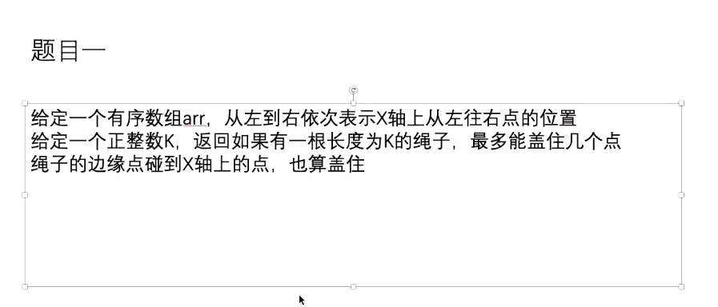
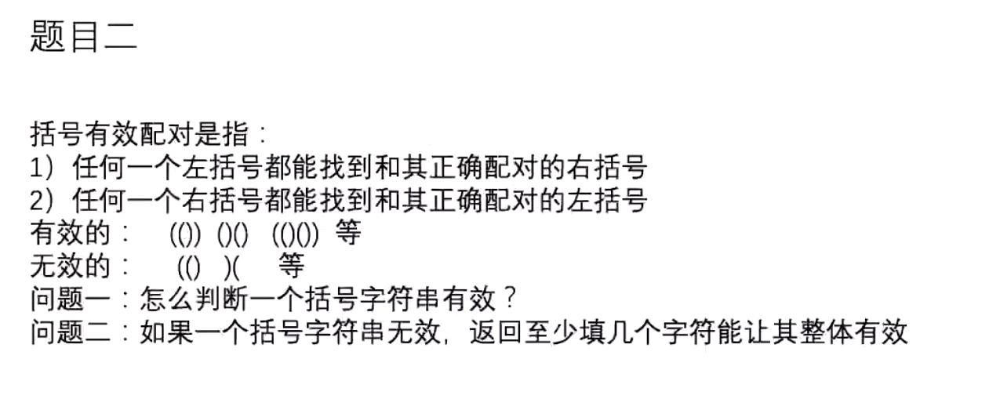
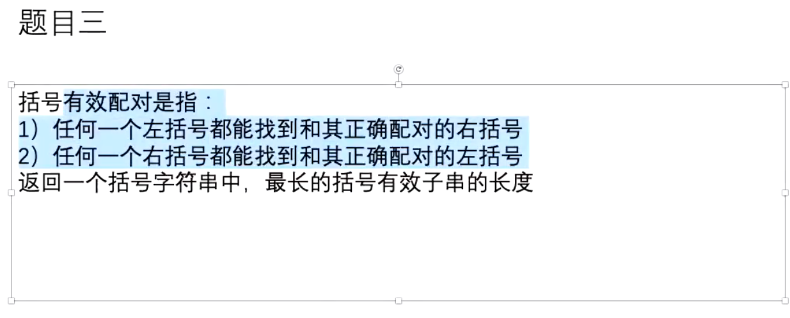
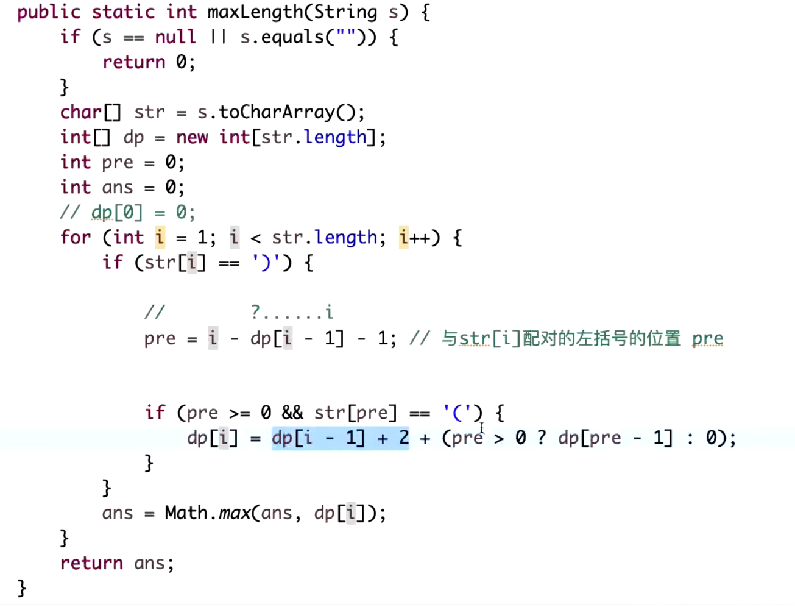

## 解题思路分析

区间单调性 滑动窗口 以i位置往右扩 扩到不能扩的时候记录一个答案

code **CordCoverMaxPoint**

**count 计数 '(' count ++ ')' count --**

1. 如果出现count < 0， 直接返回false
2. 最后count == 0 返回true 否则返回false

**count need '(' count ++ ')' count --**

1. count == -1 need++ count=0 重新赋值0
2. 最后need = need+count
   
code **ParenthesesLegal**

以i下标为结尾的最长括号有效字串的长度
[i] == '('   0
[i] == ')'   [i -1] =n 

