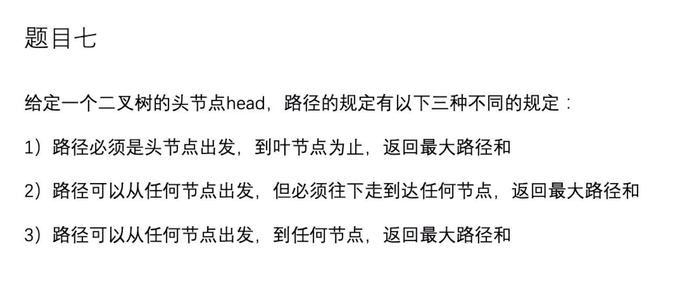

贪心算法
sum % n != 0 说明一定不能平均下来 返回-1

聚焦i小标的瓶颈  
左部分拥有的 - 左部分应该剩余的 记为moveLeft
右部分拥有的 - 右部分应该剩余的 记为moveRight
如果moveLeft < 0 && moveRight < 0 i结果为 abs(moveLeft) + abs(moveRight)
否则 i结果为 max(abs(moveLeft), abs(moveRight))
从0遍历到结尾 最大值就是最小轮数

全局最大值max
max - min(arr[0], arr[N - 1])

