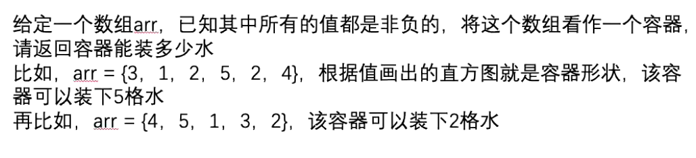
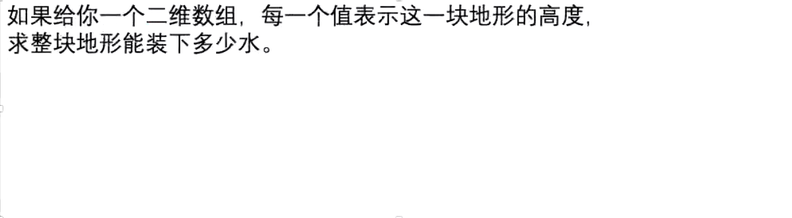
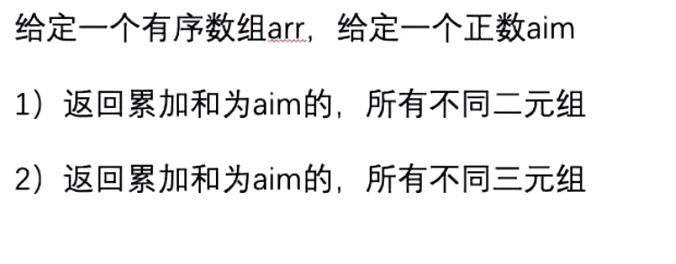

单位置的信息求出来
i的最大存储是多少？
左边max i 右边max max(min(lmax, rmax) - arr[i] , 0)
arr[i] 有可能大于 min(lmax, rmax)

流程
小根堆 (num, row, col)
boolean **isenter** 表示(row, col) 是否进入过堆
**max** = 0
**water** = 0
弹出 堆顶
更新max
将(row, col)上下左右 压入堆 压入时 计算water值 water = water + max(0, max - num)

code **TrappingRainWater**

