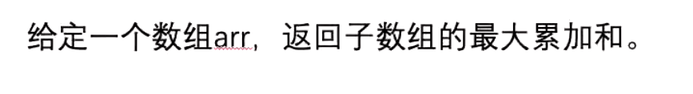
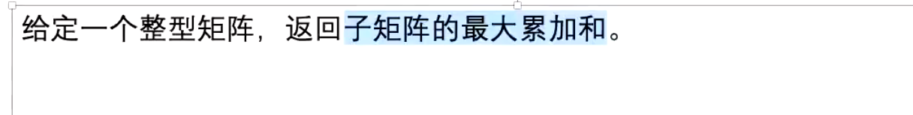
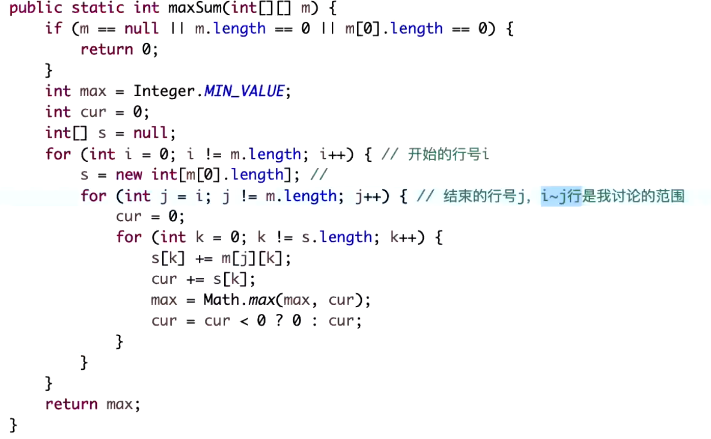
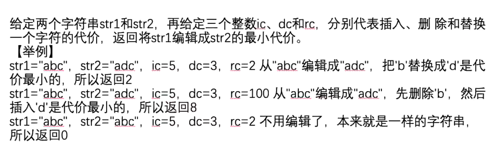
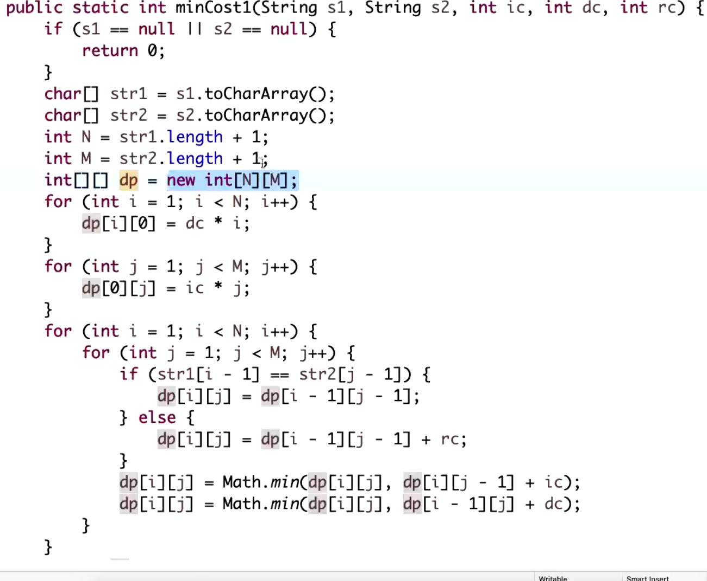
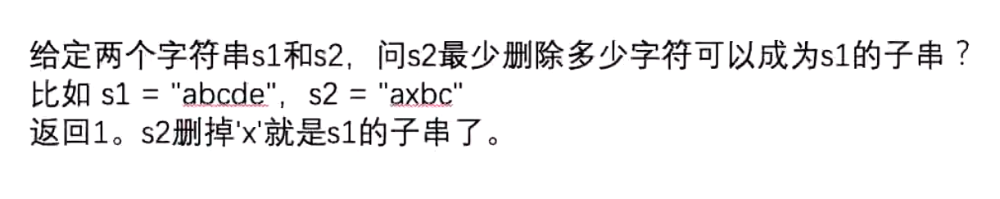

假设答案法

假设 i...j 是最大累加和且子数组最大长度

i<k<j i...k 不可能小于0

k...i -1 不可能大于0

**思路**
含且必须只含0行
含且必须只含0 - 1行
含且必须只含0 - 2行
含且必须只含0 - i行

含且必须只含1行
含且必须只含1 - 1行
含且必须只含1 - 2行
含且必须只含1 - i行
.。。。。

压缩数组技巧 变成1行数据

一个样本做行 一个样本做列的样本对应模型
**通过结尾的可能性来讨论**

