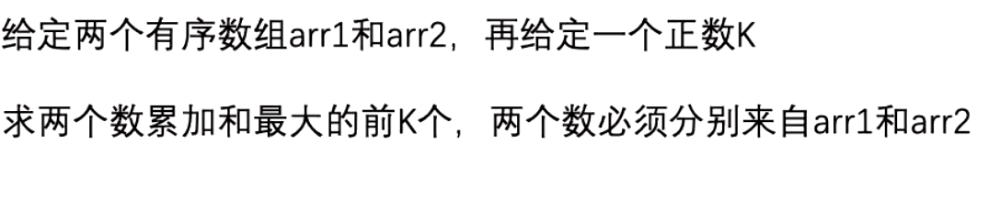
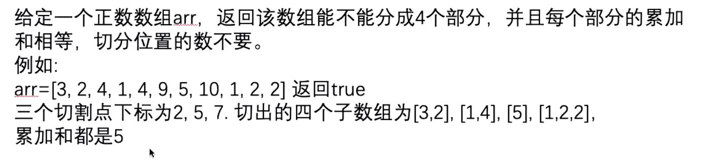
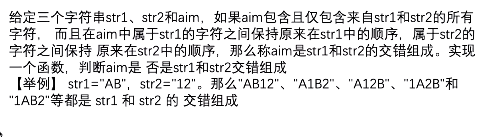
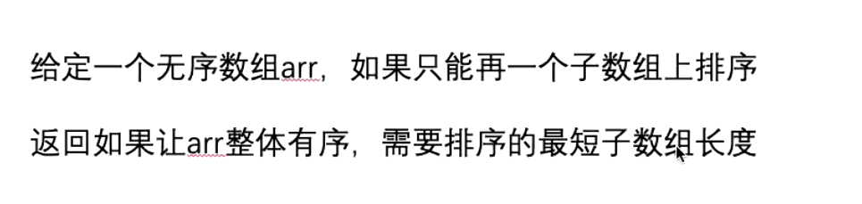
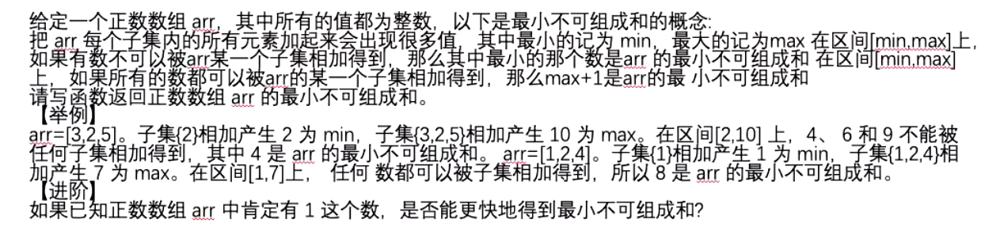
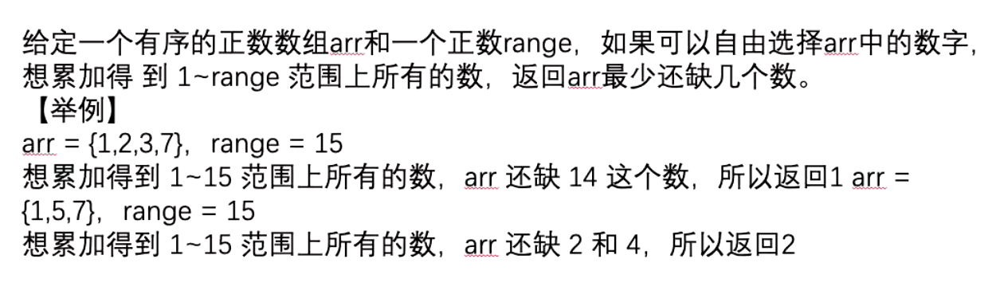
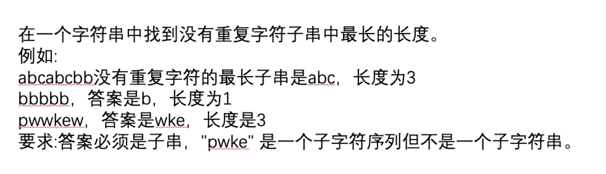

### 题目一

升序排序

top1 肯定是2个数组最大值相加 v1(n-1, m-1) （n-1为数组1下标，m-1为数组2下标，下同）

top2 肯定是一个数组最大值 + 另一个数组的第二大值 v2(n-1, m-2), v3(n-2, m-1) 假定v2大

top3 候选的值为v3(n-2, m-1) 以及top2的v2(n-1, m-2)相邻位置 v4(n-1, m-3) 和v5(n-2, m-2)

...

采用大根堆结构 <b>大根堆结构</b> 每次pop 并将取值的坐标以及对应坐标值的和 放入大根堆 取出k个就能得出结果

Code: <b>SumFromTwoArrayTopK</b>

### 题目二

### 题目三

### 题目四

2个循环 
第一次循环 
从左往右遍历，记录最大值maxLeft 来到i位置时 i位置左边的最大值为maxLeft 如果array[i] >= maxLeft 说明排序时左边的不需要往后交换 记录☑️
如果array[i] < maxLeft 说明排序时左边的要交换过来 记录✕ 遍历完后得出最右的下标r 
第二次循环 
从右往左遍历，记录最小值minRight 来到i位置时 i位置右边的最小值为minRight 如果array[i] <= minRight 说明排序时右边的不需要往后交换 记录☑️
如果array[i] < minRight 说明排序时右边的要交换过来 记录✕ 遍历完后得出最左的下标l 
**结果就是l - r的子数组 长度为 r - l + 1**

### 题目五

### 题目六

### 题目七

ans
dp[i] 必须以i结尾最大无重复字符子串的开始下标(长度也可以，下标方便计算而已) 
如果str.indexof(i) = x , x上次出现的下标记为 lastX (用map记录) 
dp[i - 1] 的值为 p 
dp[i] = lastX + 1, p取max 
大小为i - dp[i] + 1 ans = max{ans, i-dp[i] + 1} 
返回ans 
Code **NoRepeatSubStringLength**

