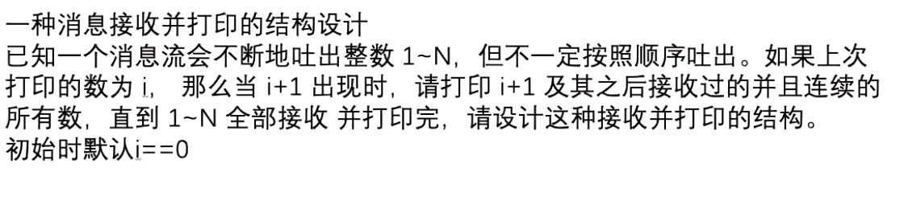

### P1

消息来的时机不一定是正确的 有可能后到。
消息到了之后需要如不不是当前需要打印的，需要保留下来。
如果是当前需要打印的，那么将连续的区间消息一块打印。 

**结构** 
Node 节点来存储消息。 next指向紧挨着的下个节点 没有的话为null。 

维持**headMap** **tailMap**. 
headMap 表示区间的左边界， tailMap表示区间的右边界。

**流程**: 
1. 当一个消息过来时, 创建一个Node对象Node_i用来保存消息。假设此时编号为i
2. 放入headMap和tailMap
3. 看看tailMap中有没有i - 1的节点，如果有，则Node_i-1 的next指向Node_i，并在tailMap中删除Node_i-1
4. 看看headMap中有没有i + 1的节点，如果有，则Node_i 的next值向Node_i+1
5. 判断i是否是等待的节点 如果是 则打印 打印时注意等待编号、headMap、tailMap的变化设置

### P2

2个动态规划

### P3
