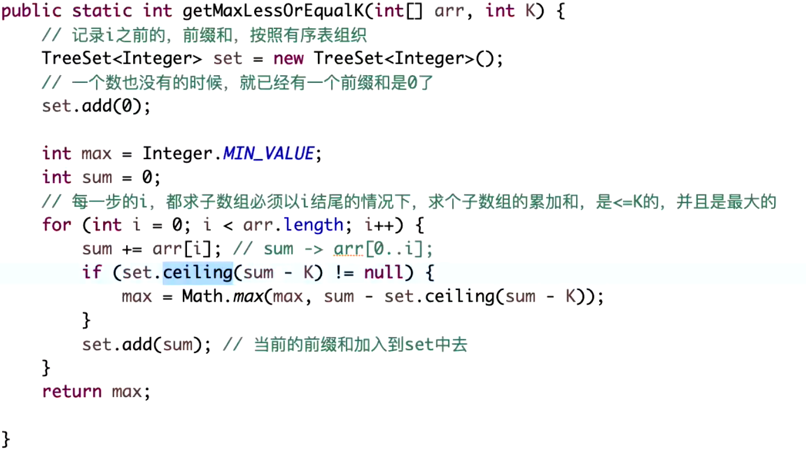
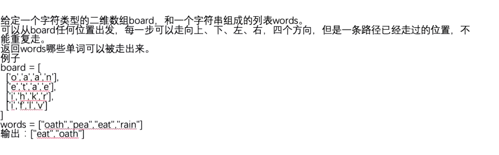
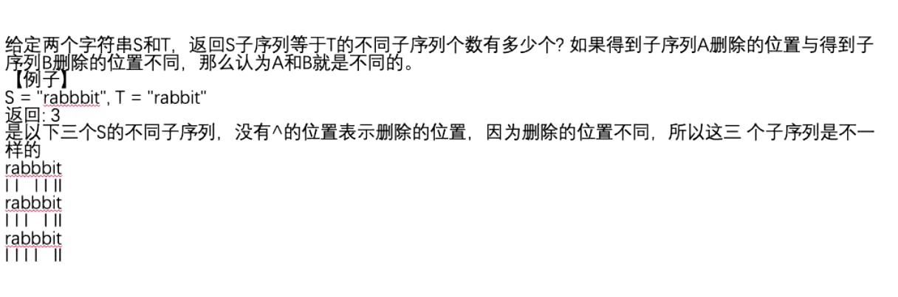

### 题目一

给定一个数组arr，再给定一个k值 返回累加和小于等于k，但是离k最近的子数组累加和。 

### 题目二
给定一个二维数组matrix，再给定一个k值
返回累加和小于等于k，但是离k最近的子和矩阵累加和

### 题目三

**LongestIncreasingPath**

### 题目四

### 题目五

一个样本做行，一个样本做列，样本对应模型

dp[i][j] 表示 s1[0...i] 有多少种方案变成 s2[0...j]

第一行 [0][0] s1[0] == s2[0] 1否则 0 s1[1...] = 0

第一列 s[i] = s2[0] dp[i][0] = dp[i - 1] + 1否则 dp[i][0] = dp[i - 1]

可能性分析
1.删除i dp[i - 1][j]
2.保留i 前提是 s1[i] == s2[j] dp[i - 1][j - 1]

dp[i][j] = dp[i - 1][j] + s1[i] == s2[j] ? dp[i - 1][j - 1] : 0;