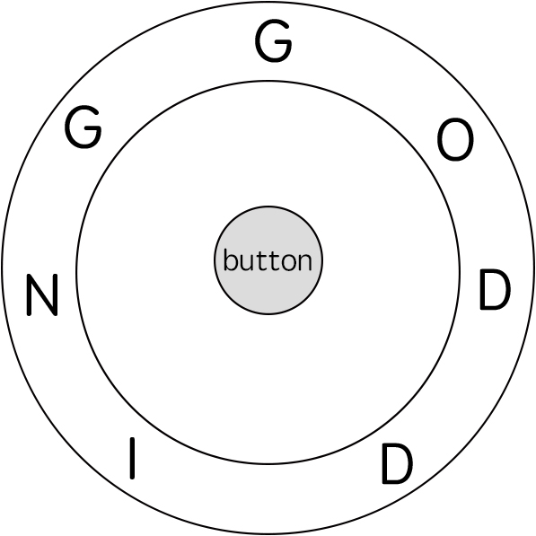

### 题目一

``` 
判定一个由［a—z］字符构成的字符串和一个包含'.'和'*'通配符的字符串是否匹配。
通配符'.'匹配任意单一字符，'*'匹配任意多个字符包括0个字符。字符串长度不会超过100，字符串不为空。
输入描述：
字符串str和包含通配符的字符串 pattern。1 ＜＝字符串长度 ＜＝100输出描述：true 表示匹配，false 表示不匹配
```

### 题目二


``` 
In the video game Fallout 4, the quest "Road to Freedom" requires players to reach a metal dial called the "Freedom Trail Ring" and use the dial to spell a specific keyword to open the door.
Given a string ring that represents the code engraved on the outer ring and another string key that represents the keyword that needs to be spelled, return the minimum number of steps to spell all the characters in the keyword.

Initially, the first character of the ring is aligned at the "12:00" direction. You should spell all the characters in key one by one by rotating ring clockwise or anticlockwise to make each character of the string key aligned at the "12:00" direction and then by pressing the center button.

At the stage of rotating the ring to spell the key character key[i]:

You can rotate the ring clockwise or anticlockwise by one place, which counts as one step. The final purpose of the rotation is to align one of ring's characters at the "12:00" direction, where this character must equal key[i].
If the character key[i] has been aligned at the "12:00" direction, press the center button to spell, which also counts as one step. After the pressing, you could begin to spell the next character in the key (next stage). Otherwise, you have finished all the spelling.
 

Example 1:

Input: ring = "godding", key = "gd"
Output: 4
Explanation:
For the first key character 'g', since it is already in place, we just need 1 step to spell this character. 
For the second key character 'd', we need to rotate the ring "godding" anticlockwise by two steps to make it become "ddinggo".
Also, we need 1 more step for spelling.
So the final output is 4.
Example 2:

Input: ring = "godding", key = "godding"
Output: 13
 

Constraints:

1 <= ring.length, key.length <= 100
ring and key consist of only lower case English letters.
It is guaranteed that key could always be spelled by rotating ring.
```

### 题目三
``` 
给定一个数组arr，代表一排有分数的气球。
每打爆一个气球都能获得分数，假设打爆气球的分数为X，获得分数的规则如下：
1）如果被打爆气球的左边有没被打爆的气球，找到离被打爆气球最近的气球，假设分数为L；
如果被打爆气球的右边有没被打爆的气球，找到离被打爆气球最近的气球，假设分数为R。获得分数为L＊X＊R。
2）如果被打爆气球的左边有没被打爆的气球，找到离被打爆气球最近的气球，假设分数为L；
如果被打爆气球的右边所有气球都已经被打爆。获得分数为L＊X。
3）如果被打爆气球的左边所有的气球都已经被打爆；
如果被打爆气球的右边有没被打爆的气球，找到离被打爆气球最近的气球假设分数为R；
如果被打爆气球的右边所有气球都已经被打爆。获得分数为X＊R。4）如果被打爆气球的左边和右边所有的气球都已经被打爆。获得分数为X。

目标是打爆所有气球，获得每次打爆的分数。通过选择打爆气球的顺序，可以得到不同的总分，请返回能获得的最大分数。【举例】

arr＝｛3，2，5｝
如果先打爆3，获得3＊2；再打爆2，获得2＊5；最后打爆5，获得5；最后总分21
如果先打爆3，获得3＊2；再打爆5，获得2＊5；最后打爆2，获得2；最后总分18
如果先打爆2，获得3＊2＊5；再打爆3，获得3＊5；最后打爆5，获得5；最后总分50
如果先打爆2，获得3＊2＊5；再打爆5，获得3＊5；最后打爆3，获得3；最后总分48
如果先打爆5，获得2＊5；再打爆3，获得3＊2；最后打爆2，获得2；最后总分18
如果先打爆5，获得2＊5；再打爆2，获得3＊2；最后打爆3，获得3；最后总分19
返回能获得的最大分数为50
```
范围尝试 L..R 认为制造前提条件 L - 1, R + 1的位置上的值没有爆
构造新的数组, [1, 原arr, 1]
f(arr, 0, 原arr.length + 2 - 1)

**组织可能性,哪个位置最后打爆**
1) L :  arr[L] * arr[L - 1] * arr[R + 1] + f(arr, L + 1, R)
2) R :  arr[R] * arr[L - 1] * arr[R + 1] + f(arr, L, R - 1)
3) (L...R) : arr[i] * arr[L - 1] * arr[R + 1] + f(arr, L, i - 1) + f(arr, i + 1, R)

求所有分支的最大值

### 题目四
``` 
给定一个数组arr，和一个整数k。
这代表你可以把相邻的k个数字合成一个数字，每一次合并的代价是这些数字的累加和。最终你的目标是把arr中所有数字合成一个，返回最小代价。

Input:stones=[3,2,4,1], K=2  
Output:20
解释：
一开始是［3，2，4，1］，只能相邻的2个数字合成一个数字。
先合并［3，2］变成5，代价是5。那么就得到了［5，4，1］。
先合并［4，1］变成5，代价是5。那么就得到了［5，5］。
先合并［5，5］变成10，代价是10。那么就得到了一个数字10。
总代价是20，而且这种方案是最省的。

Input:stones=[3,2,4,1] K=3 Output:-1
解释：
只能相邻的3个数字合成一个数字，那么合并一次，数字就不够了。所以返回-1。

Input:stones=[3,5,1,2,6],K=3 
Output:25
解释
开始是［3，5，1，2，6］，只能相邻的3个数字合成一个数字。
先合并［5，1，2］变成8，代价是8，就变成了［3，8，6］
再合并3，8，6］变成17，代价17，就变成了［17］
总代价是25，而且是所有方案中最小的。
```